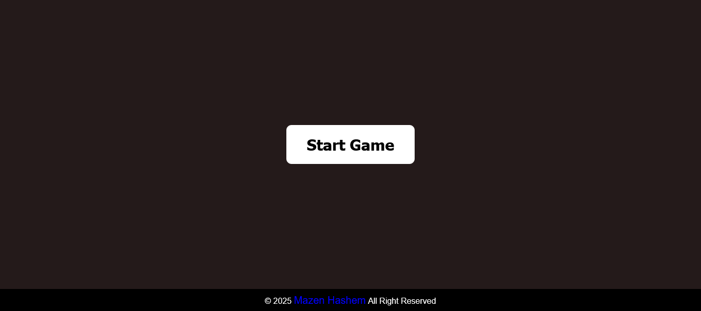
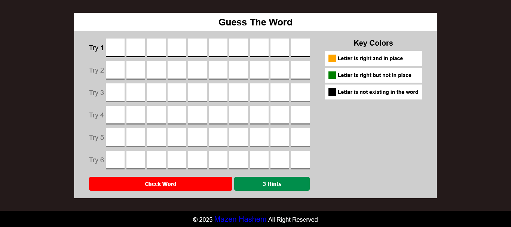
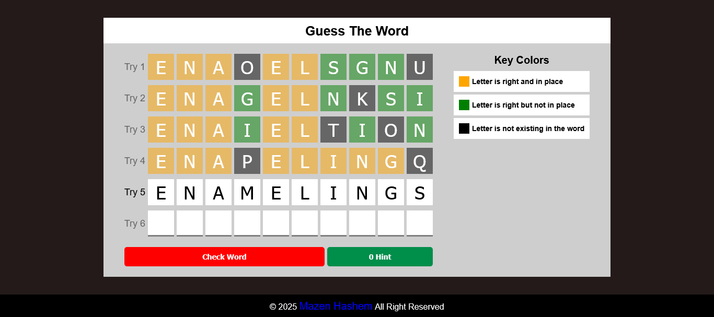
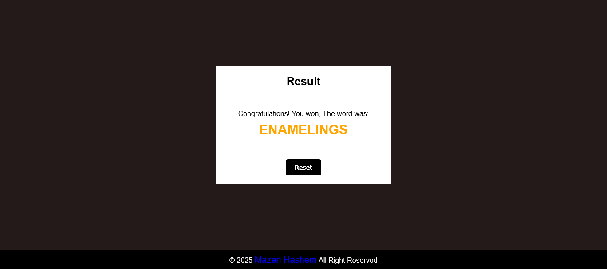
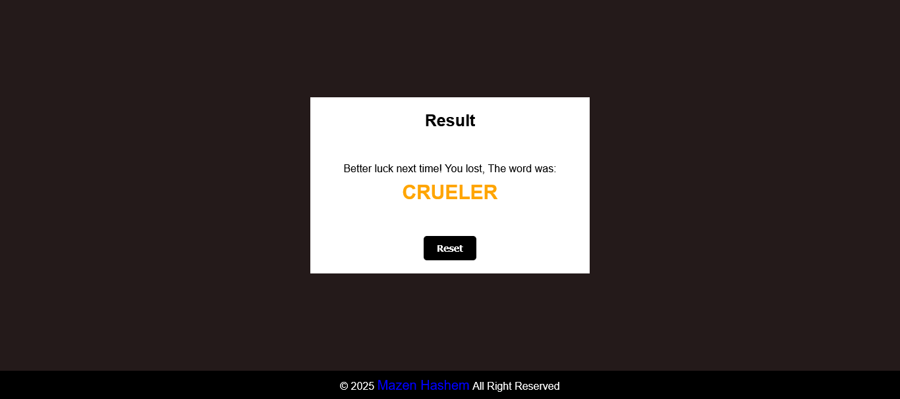

<h1>Guess The Word Game</h1>

  

<h2>Description</h2>

  This is a Guess The Word Game made by 
  <em>HTML</em> , 
  <em>CSS</em> and
  <em>JavaScript</em> languages.
  Inspired by 
  <strong>
    <a href="https://www.youtube.com/@ElzeroWebSchool">ElzeroWebSchool</a>
  </strong> 
  channel.

My goal from this project is to show my experience in Front-end web development.

<h3><u>Functionality:</u></h3>
<h4>On window load:-</h4>
<ul>
  <li>it will fetch game data from local json file.</li>
  <li>After success fetch, one random word will be chosen from handreds of words.</li>
  <li>Number of inputs in every try, number of tries and hints will depend on the size of the word.</li>
</ul>
<h4>On click start:-</h4>
<ul>
  <li>Game will create and functionality of buttons will run.</li>
  <li>Player can read the rules of the game.</li>
</ul>
<h4>While playing:-</h4>
<ul>
  <li>
    <h5>Background color of inputs after click check word button (Game rules):</h5>
    <ul>
      <li>Orange: Letter is right and in place.</li>
      <li>Green: Letter is right but not in place.</li>
      <li>black: Letter is not existing in the word.</li>
    </ul>
  </li>
  <li>Player can go throw inputs of the current try by mouse left click or right and left Arrow key or while typing.</li>
  <li>Player can't click check word button until all inputs of the current try have valid value (A-Z).</li>
  <li>Hint button will show random letters in the current word with the current try.</li>
  <li>If player answer is right: game will stop and show result with wining message, if not: player will go to the next try, until the avaliable tries finish, then the game will stop and show result with lossing message.</li>
</ul>

<h3><u>Responsiveness:</u></h3>

  The website is responsive, it created to use across all devices, such as modern desktops, tablets, and phone browsers.

<h2>Screenshot</h2>
<h3><u>Start:</u></h3>

<h3><u>Game box:</u></h3>

<h3><u>Result:</u></h3>
<h4>Wining:-</h4>

<h4>Losing:-</h4>
